# Notecore

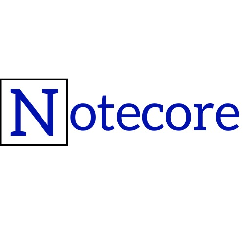

>## 📱 O Notecore é um aplicativo de notas, que tem o objetivo de registrar momentos ou armazenar lembretes!

### Aplicação desenvolvida para o trabalho final da matéria Desenvolvimento para Dispositivos Móveis.

- O trabalho proposto teve o intuito de aplicar todo o conhecimento adquirido durante o semestre, criando uma aplicação mobile. 

>## 🛠 Tecnologias

- Dart
- Flutter
- Firebase
- Firestore
- Git e GitHub

># ⚙️ Como funciona?

>## 🔐 Cadastro e login

### Login

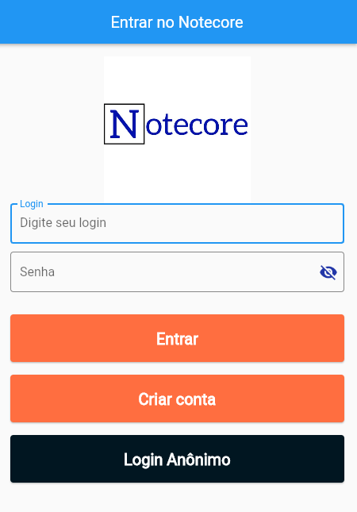

Assim que o usuário entra na aplicação é direcionado a tela de login. Nesta tela o usuário terá duas opções: 
- Inserir seu e-mail e senha em seus respectivos campos e clicar no botão "Entrar" caso seja cadastrado.
- Se cadastrar clicando no botão "Criar conta".

> 🔥 A autenticação de usuário é feita utilizando o Firebase, uma plataforma da Google criada para facilitar a criação de aplicações.

### Cadastro

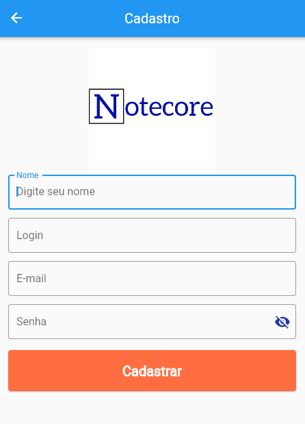

Na tela de cadastro, o usuário irá inserir os dados requisitados em cada campo e clicar no botão "Cadastrar", caso todos os campos cumpram os requisitos necessários. O formulário é enviado e os dados vão para o banco de dados.

>## 📅 Calendário

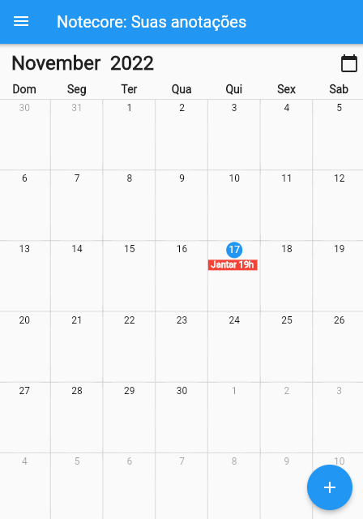

Após o usuário ter sido autenticado pelo Firebase, ele é redirecionado a tela de calendário. Na tela de calendário o usuário terá algumas opções, sendo elas:
- Entrar em algum dia específico.
- Verificar as notas do dia escolhido.
- Criar uma nota para o dia atual.
- Acessar a sidebar clicando no canto superior esquerdo.

>## 📝 Notas

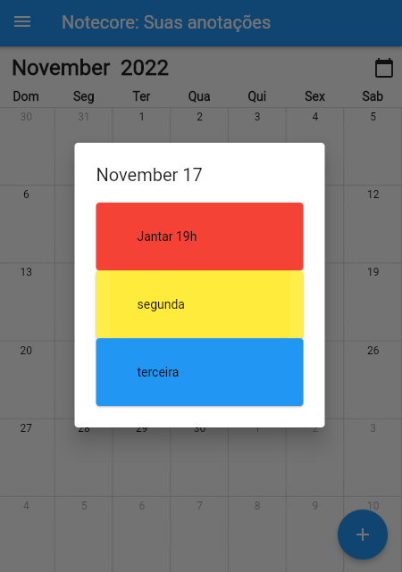

Caso o usuário tenha escolhido "entrar" em algum dia, ele poderá executar as ações de:
- Criar uma nova nota clicando no botão flutuante.
- Acessar uma nota específica clicando na mesma.
- Acessar a sidebar clicando no canto superior esquerdo.
- Editar uma nota aberta clicando no lápis de edição.
- Alterar a cor da nota clicando na paleta.

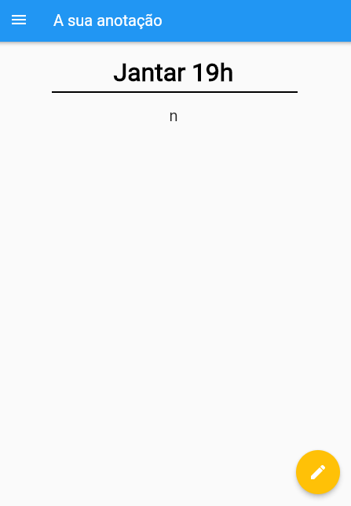

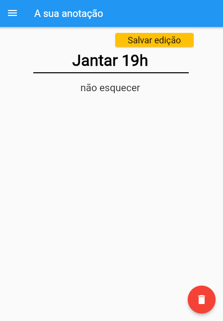

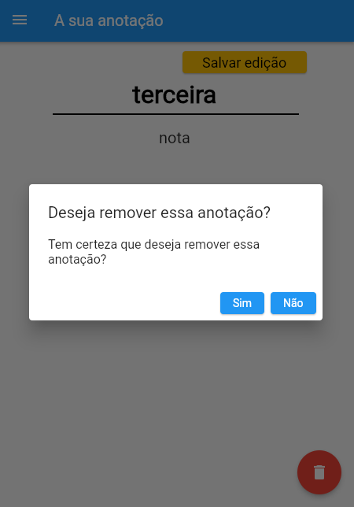

>## 📲 Sidebar

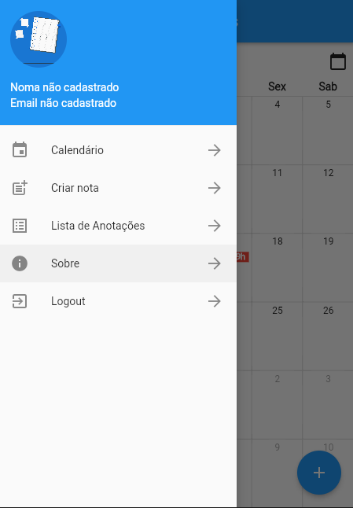

Ao clicar no canto superior esquerdo, será exibido para o usuário sua sidebar. Na sidebar teremos as opções:
- Calendário.
- Criar nota.
- Lista de anotações.
- Sobre.
- Logout.

>## 📃 Lista de notas

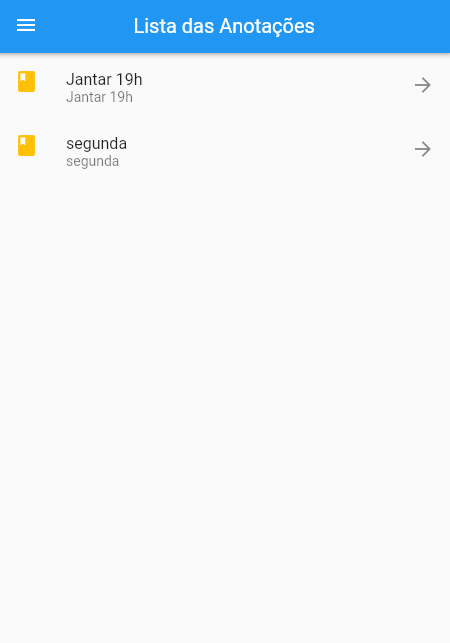

Ao clicar na opção de Lista de anotações, será exibido todas as notas criadas pelo usuário.

>## 🚪 Sobre

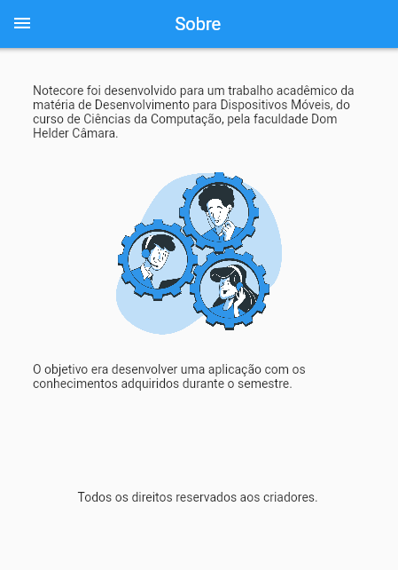

Ao clicar no botão "Sobre" na sidebar o usuário será redirecionado para a página que fala um pouco sobre o projeto Notecore.

>## 🖥 Desenvolvedores

### [👨🏻‍💻 Bryan Wille](https://github.com/BryanWille)
### [👨🏾‍💻 Cauã Henrique](https://github.com/CauaHvS)
### [👨🏽‍💻 Nathan Marques](https://github.com/NathanMarques2001)
